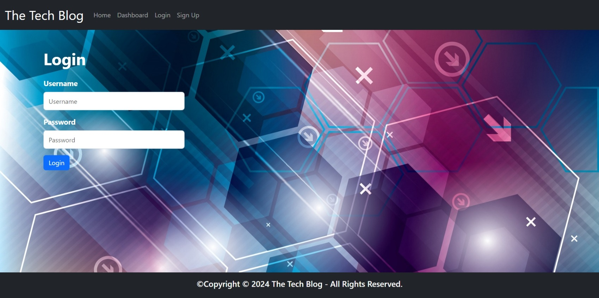

<div align ="center">

# The-Tech-Blog


</div>

## Table of Contents
- [Description](#description)
- [User Story](#user-story)
- [Acceptance Criteria](#acceptance-criteria)
- [Technologies](#technologies)
- [Installation](#installation)
- [Usage](#usage)
- [Screenshot](#screenshot)
- [Contributions](#contributions)
- [Tests](#tests)
- [Links](#links)
- [Contact Information](#contact-information)
- [License](#license)

## Description
Welcome to my Tech Blog project! In this week's challenge, as a transitional web developer I was tasked with creating a Tech Blog application. This project is a CMS-style blog site designed for developers eager to share their insights and opinions on the latest in technology. Whether you're looking to publish articles, blog posts, or simply express your thoughts, Tech Blog provides the platform you need. Upon your initial visit, you'll find yourself on the homepage, where existing blog posts are displayed alongside navigation links for easy access to the homepage and dashboard. From here, you can either sign up or sign in to get started. Signing up is straightforward – simply create a username and password, and you're all set to begin your journey. Once logged in, you'll enjoy access to the homepage, dashboard, and the ability to log out securely. The homepage offers a glimpse into the world of tech blogging with existing posts showcasing titles and creation dates. Clicking on a post reveals its contents, the creator's username, creation date, and the option to leave a comment. Meanwhile, the dashboard serves as your personal command center, allowing you to manage existing posts, create new ones, update them, or even delete as necessary. And for added security, if you happen to idle on the site for too long, it will automatically prompt you to log in again before performing any actions. Join us on this platform, where your voice in the tech community matters.

## User Story
```
AS A developer who writes about tech
I WANT a CMS-style blog site
SO THAT I can publish articles, blog posts, and my thoughts and opinions
```

## Acceptance Criteria
```
GIVEN a CMS-style blog site
WHEN I visit the site for the first time
THEN I am presented with the homepage, which includes existing blog posts if any have been posted; navigation links for the homepage and the dashboard; and the option to log in
WHEN I click on the homepage option
THEN I am taken to the homepage
WHEN I click on any other links in the navigation
THEN I am prompted to either sign up or sign in
WHEN I choose to sign up
THEN I am prompted to create a username and password
WHEN I click on the sign-up button
THEN my user credentials are saved and I am logged into the site
WHEN I revisit the site at a later time and choose to sign in
THEN I am prompted to enter my username and password
WHEN I am signed in to the site
THEN I see navigation links for the homepage, the dashboard, and the option to log out
WHEN I click on the homepage option in the navigation
THEN I am taken to the homepage and presented with existing blog posts that include the post title and the date created
WHEN I click on an existing blog post
THEN I am presented with the post title, contents, post creator’s username, and date created for that post and have the option to leave a comment
WHEN I enter a comment and click on the submit button while signed in
THEN the comment is saved and the post is updated to display the comment, the comment creator’s username, and the date created
WHEN I click on the dashboard option in the navigation
THEN I am taken to the dashboard and presented with any blog posts I have already created and the option to add a new blog post
WHEN I click on the button to add a new blog post
THEN I am prompted to enter both a title and contents for my blog post
WHEN I click on the button to create a new blog post
THEN the title and contents of my post are saved and I am taken back to an updated dashboard with my new blog post
WHEN I click on one of my existing posts in the dashboard
THEN I am able to delete or update my post and taken back to an updated dashboard
WHEN I click on the logout option in the navigation
THEN I am signed out of the site
WHEN I am idle on the site for more than a set time
THEN I am able to view posts and comments but I am prompted to log in again before I can add, update, or delete posts
```

## Technologies
The technologies I used in this challenge includes:

1. Node.js
2. Express-handlebars
3. Sequelize
4. Node MySQL2
5. Dotenv
6. Bcrypt package
7. Express-session
8. Connect-session-sequelize
9. Visual Studio Code(VS-code)
10. Github: Github was used to create a repository which includes all the required files following the MVC paradigm in its architectural structure, the links to the projects, package.json, and the README file.
11. Gitlab: Gitlab was used to clone the project to our laptop.

## Installation
1. To install the challenge#14 , first create a new repository in your Github account, and then clone this repository to your local computer. 
```
To clone: git clone https://github.com/your-username/repository-name.git   
```           
2. Install bcrypt [v5.1.1], connect-session-sequelize [v7.1.7], express-handlebars [v7.1.2], express-session [v1.18.0].

3. Install Sequelize [v6.37.1], Node MySQL2 [v3.9.2], and Dotenv [v16.4.5].

4. Open the cloned repository in a visual studio code.
 
5. Open integrated terminal on server.js in order to run "npm install" on the command line to install dependencies. In addition, create a gitignore file, which should includes node_modules, .env file, and .DS_Store.   

## Usage
1. Open the repository, run 'npm install' to install dependencies and update the '.env file'.

2. To initiate the database setup, utilize the schema.sql file located in the db folder by executing MySQL shell commands. Similarly, use the environment variable to store sensitive data like your MySQL username, password, and database name. 

3. Use the command 'npm run seed' to populate the database with test data. Afterwards, initiate the server and synchronize the Sequelize models with the MySQL database by running 'npm start'.

4. View the application either through the command-line terminal or by the deployed link.

## Screenshot





## Contributions
Contributions to the Tech Blog are welcome and encouraged. Here are some ways you can contribute:

1. **Bug Reports and Feature Requests:**
  - If you encounter any issues or have suggestions for new features, please open an issue on the GitHub repository.
    
2. **Enhancements to Tech Blog Application:**
  -  We welcome contributions aimed at improving this application. If you find ways to enhance the application or identify any limitations, feel free to submit a pull request.

3. **Documentation Improvements:**
  - Help improve the clarity and completeness of this documentation. If you find areas that need clarification or additional information, submit a pull request with your suggested changes.     

## Tests
There are no tests required for this project.

## Links
- [Heroku deployed link](https://protected-inlet-55523-04642559360f.herokuapp.com/)
- [GitHub repository](https://github.com/MunibaP/The-Tech-Blog.git)
  
## Questions
I appreciate and encourage any questions you may have. Feel free to reach out for further information.
  
## Contact Information
- GitHub: [MunibaP](https://github.com/MunibaP)
- Email: munibapervez596@gmail.com

## License
Please refer to [MIT]() to acquire details about this license 

### Copyright © 2024 Muniba Pervez

Permission is hereby granted, free of charge, to any person obtaining a copy of this software and associated documentation files (the “Software”), to deal in the Software without restriction, including without limitation the rights to use, copy, modify, merge, publish, distribute, sublicense, and/or sell copies of the Software, and to permit persons to whom the Software is furnished to do so, subject to the following conditions:

The above copyright notice and this permission notice shall be included in all copies or substantial portions of the Software.

THE SOFTWARE IS PROVIDED “AS IS”, WITHOUT WARRANTY OF ANY KIND, EXPRESS OR IMPLIED, INCLUDING BUT NOT LIMITED TO THE WARRANTIES OF MERCHANTABILITY, FITNESS FOR A PARTICULAR PURPOSE AND NONINFRINGEMENT. IN NO EVENT SHALL THE AUTHORS OR COPYRIGHT HOLDERS BE LIABLE FOR ANY CLAIM, DAMAGES OR OTHER LIABILITY, WHETHER IN AN ACTION OF CONTRACT, TORT OR OTHERWISE, ARISING FROM, OUT OF OR IN CONNECTION WITH THE SOFTWARE OR THE USE OR OTHER DEALINGS IN THE SOFTWARE.
